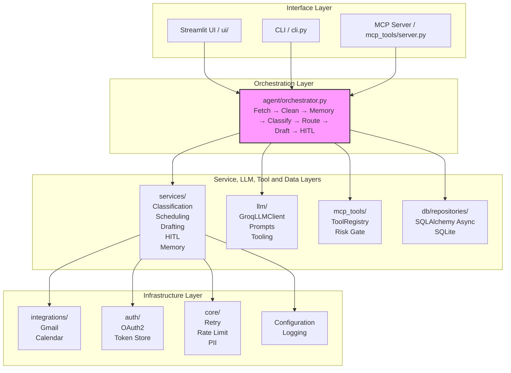
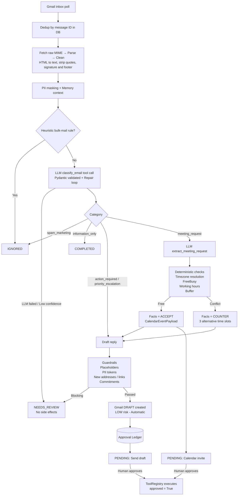

# Architecture

## 1. Layered View (Clean Architecture)

```mermaid
flowchart TD

    subgraph Interface["Interface Layer"]
        UI["Streamlit UI / ui/"]
        CLI["CLI / cli.py"]
        MCP["MCP Server / mcp_tools/server.py"]
    end

    subgraph Orchestration["Orchestration Layer"]
        ORCH["agent/orchestrator.py<br/>Fetch → Clean → Memory → Classify → Route → Draft → HITL"]
    end

    subgraph Application["Service, LLM, Tool and Data Layers"]
        direction LR

        SERVICES["services/<br/>Classification<br/>Scheduling<br/>Drafting<br/>HITL<br/>Memory"]

        LLM["llm/<br/>GroqLLMClient<br/>Prompts<br/>Tooling"]

        TOOLS["mcp_tools/<br/>ToolRegistry<br/>Risk Gate"]

        DB["db/repositories/<br/>SQLAlchemy Async<br/>SQLite"]
    end

    subgraph Infrastructure["Infrastructure Layer"]
        direction LR

        INTEGRATIONS["integrations/<br/>Gmail<br/>Calendar"]

        AUTH["auth/<br/>OAuth2<br/>Token Store"]

        CORE["core/<br/>Retry<br/>Rate Limit<br/>PII"]

        CONFIG["Configuration<br/>Logging"]
    end

    UI --> ORCH
    CLI --> ORCH
    MCP --> ORCH

    ORCH --> SERVICES
    ORCH --> LLM
    ORCH --> TOOLS
    ORCH --> DB

    SERVICES --> INTEGRATIONS
    SERVICES --> AUTH
    SERVICES --> CORE
    SERVICES --> CONFIG

    style ORCH fill:#f9f,stroke:#333,stroke-width:2px
```

## 2. Email Processing & Decision Flow

```mermaid
flowchart TD

    A["Gmail inbox poll"] --> B["Dedup by message ID in DB"]

    B --> C["Fetch raw MIME → Parse → Clean<br/>HTML to text, strip quotes, signature and footer"]

    C --> D["PII masking + Memory context"]

    D --> E{"Heuristic bulk-mail rule?"}

    E -->|Yes| S["IGNORED"]
    E -->|No| F["LLM classify_email tool call<br/>Pydantic validated + Repair loop"]

    F -->|LLM failed / Low confidence| R["NEEDS_REVIEW<br/>No side effects"]

    F --> G{"Category"}

    G -->|spam_marketing| S
    G -->|information_only| Z["COMPLETED"]
    G -->|action_required / priority_escalation| H["Draft reply"]
    G -->|meeting_request| M["LLM extract_meeting_request"]

    M --> N["Deterministic checks<br/>Timezone resolution<br/>FreeBusy<br/>Working hours<br/>Buffer"]

    N -->|Free| O["Facts = ACCEPT<br/>CalendarEventPayload"]
    N -->|Conflict| P["Facts = COUNTER<br/>3 alternative time slots"]

    O --> H
    P --> H

    H --> Q["Guardrails<br/>Placeholders<br/>PII tokens<br/>New addresses / links<br/>Commitments"]

    Q -->|Blocking| R
    Q -->|Passed| T["Gmail DRAFT created<br/>LOW risk - Automatic"]

    T --> U[("Approval Ledger")]

    U --> V["PENDING: Send draft"]
    O --> W["PENDING: Calendar invite"]

    V -->|Human approves| X["ToolRegistry executes<br/>approved = True"]
    W -->|Human approves| X
```
